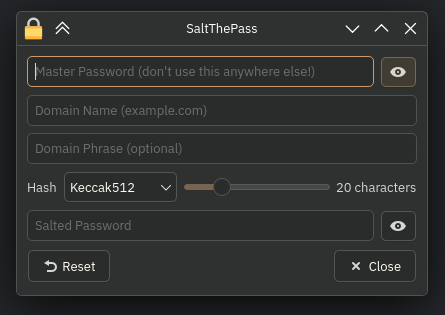

# SaltyQt
Python-only port of SaltThePass.js (Salt The Pass) by Nic Jansma, with Qt6 GUI.

### Dependencies
- PySide6
- pycryptodome

Use `pip` or find these in your package manager.

### Usage
`python3 SaltyQt.py`

Refer to the [original site](https://saltthepass.com/#help) for how it's used.

**Important:** `Keccak512` is the default hashing algorithm, same as [the website](https://saltthepass.com) even though it says `SHA-3` there.
 "Real" SHA-3 is different. It's a long (?) story.

To have the output (salted password) unmasked by default, open `stp_ui.py` up in a text editor and remove (or comment) line #101.
 (`self.strSaltedPass.setEchoMode(QLineEdit.EchoMode.Password)`)
 For other changes &nbsp;&nbsp;&nbsp;&nbsp;&nbsp;&nbsp;&nbsp;&nbsp;&nbsp;&nbsp;&nbsp;&nbsp;idk man just look at the code lol (might update it more)

**Tip:** Try dragging the output into your desired password field (if dropping is allowed) instead of copying it to your clipboard!

***This was tested only on Linux (Arch/CachyOS) and Windows (Wine). Untested on Windows (The Real One) and Mac.***

### Credits
GUI made with Qt Widgets Designer by The Qt Company (*Qt and KDE team: have my babies*)
 Coded with LLM assistance, supervised, with final code revised by me.
 (does not fit my definition of vibe-coding which is "when you don't even look at/make sense of the fucking code it spits out")

Thanks to Nic Jansma for the original site and code.

### Todo (Maybe)
- domain name sanitization
- "domain rules" (like the site)
- different max characters per hashing algorithm
- save preferences
- bundle eye icon svg...?
